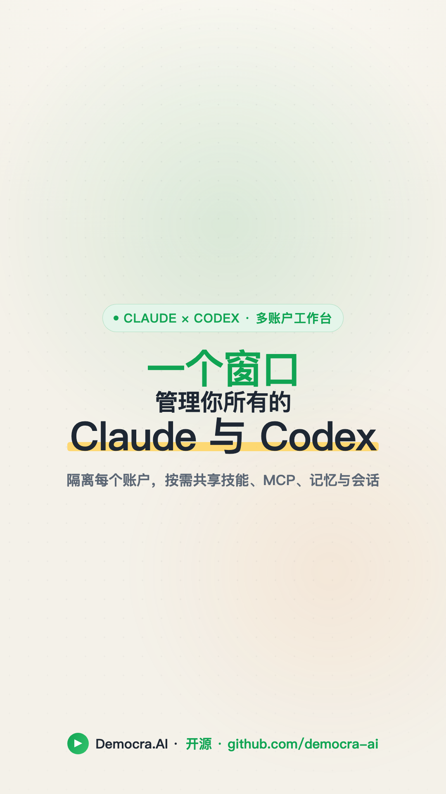

<p align="center">
  
</p>

<h1 align="center">Claudex</h1>

<p align="center">
  Run multiple <b>Claude</b> and <b>Codex</b> accounts side by side on macOS — fully isolated profiles, with skills, MCP servers, memory, and sessions shareable within and across both tools.
</p>

<p align="center">
  <a href="https://opensource.org/licenses/MIT"></a>
  <a href="https://github.com/democra-ai/claudex/releases"></a>
  <a href="https://www.apple.com/macos/"></a>
  <a href="https://v2.tauri.app/"></a>
</p>

<p align="center">
  
</p>

<p align="center">
  <a href="docs/promo/claudex-tour.zh.mp4">
    
  </a>
  <br>
  <sub>▶ <b>70-second tour</b> — real UI, narrated · <a href="docs/promo/claudex-tour.zh.mp4">中文</a> · <a href="docs/promo/claudex-tour.en.mp4">English</a></sub>
</p>

Two profile worlds — **Claude** (Desktop + Code) and **Codex** — each tinted with its own accent (Claude copper, Codex indigo), each with its own isolated logins, chats, settings, MCP, memory, and skills. Open several windows at once, each on a different account. Then share what you want between accounts — within a tool or across the Claude↔Codex boundary — from one matrix: skills, MCP servers, the agent memory file, and whole session histories. And import any session from one tool into the other as a fresh, resumable conversation.

> **Unofficial community tool.** Profiles are isolated with public flags + env vars: Claude Desktop (Electron) via `--user-data-dir`, Claude Code via `CLAUDE_CONFIG_DIR`, and the Codex desktop app (Chromium-based) via `--user-data-dir` **plus** its own `CODEX_HOME` — because Codex keeps its OAuth token in the agent home, not the browser profile, so the web dir alone wouldn't separate accounts. Not endorsed by Anthropic or OpenAI.

## Features

- **Two worlds, three accents** — Claude, Codex, and Share tabs, each retinting the whole UI to its own color (Claude copper, Codex indigo, Share green). Every profile gets its own identity color; all profiles are equal — even the original install is just another profile.
- **Fully isolated accounts** — each profile is a Desktop launcher (`.app`) with its own `--user-data-dir` (and, for Codex, its own `CODEX_HOME` + file-backed auth), so logins, chats, and tokens never collide.
- **One click, two apps** *(Claude)* — adding a Claude profile creates the Desktop launcher (`Claude WORK.app`) *and* the Code CLI alias (`claude-work`) together.
- **Share anything, anywhere** — skills, MCP servers, the agent memory file (`CLAUDE.md` / `AGENTS.md`), and whole session histories — shareable **between accounts of the same tool** and **across the Claude↔Codex boundary**, from one matrix. Symlinked surfaces (skills, memory, sessions) propagate live; format-mismatched ones (MCP JSON↔TOML) copy with transform. Non-destructive — never clobbers something it didn't create; replaced content is backed up first.
- **Per-project sessions** — both tools' sessions are grouped by project. Toggle "All sessions" to symlink a whole history between accounts, or drill into a project to import/export an individual session.
- **Cross-tool import & export** — bring a Codex session into Claude Code, *or* export a Claude Code session into Codex, as a brand-new resumable conversation. Import, not sync — see [How it works](#how-it-works).
- **Live status** — the running profile gets a pulsing dot and a `LIVE` pill; launch any profile with ▶.
- **Safe by design** — delete lives in the profile's detail panel (never an easy-to-misclick row button); erasing real data is an explicit opt-in, guarded so it can never escape the profile's own directory.
- **Profile detail** *(Claude)* — today's tokens, rolling 5h / 7d session counts, pace vs your own baseline, account identities, storage breakdown, sharing graph.
- **CLI included** — `add`, `list`, `status`, `convert`, `repair`, `remove`.

## Install

### App (recommended)

Grab the latest `.dmg` from **[Releases](https://github.com/democra-ai/claudex/releases/latest)** and drag **Claudex.app** to `/Applications`.

The build is unsigned, so first launch needs a right-click → **Open**, or:

```bash
xattr -dr com.apple.quarantine "/Applications/Claudex.app"
```

### CLI only

```bash
npm install -g github:democra-ai/claudex
```

Node 18+. The Code half works on Linux; the Desktop half is macOS-only because Claude Desktop is.

### Build from source

```bash
git clone https://github.com/democra-ai/claudex
cd claudex
npm install && npm run frontend:install
npm run tauri:dev      # GUI with hot reload
npm run tauri:build    # produces .app + .dmg
```

Requires Rust, Xcode CLT, Node 18+.

## Quick start

1. Open Claudex.
2. Sidebar bottom → **NEW PROFILE** → name it `work` → check ☑ Desktop + ☑ Code → click `+`.
3. `Claude WORK.app` lands in `~/Applications/`. Drag it to the Dock.
4. New terminal tab — the `claude-work` alias is live.
5. **Quit any other Claude window with Cmd+Q before first-launching the new profile** (the `claude://` auth deep link routes to whichever Claude is already running).

CLI equivalent: `claude-multiprofile add`.

## How it works

**Claude Desktop** is an Electron app and honors `--user-data-dir`, which relocates all app state (auth, chats, settings, MCP, projects) to a directory of your choosing. The launcher is a tiny AppleScript bundle: `open -n -a Claude --args --user-data-dir=/path/to/profile`. Different folder → different instance.

**Claude Code** honors the `CLAUDE_CONFIG_DIR` env var, so each profile reads/writes its own config dir (`~/.claude-<name>`).

**Codex** is Chromium-based and honors `--user-data-dir` too — but that only isolates the *web* layer. Codex's OAuth token lives in its **agent home** (`$CODEX_HOME`, default `~/.codex`), shared by every instance regardless of `--user-data-dir`. So a Codex profile gets all three: its own `--user-data-dir`, its own `CODEX_HOME` (`~/.codex-<name>`, passed via `open --env`), and `cli_auth_credentials_store = "file"` seeded into that home — the last one because Codex otherwise defaults to a *global* macOS-Keychain token that `CODEX_HOME` can't separate. Launch via `open -n -a Codex --env CODEX_HOME=… --args --user-data-dir=…`.

**Sharing.** Two models. Skills, the memory file, session histories, and extensions are *symlinked* — edits propagate live, and share-state is detected bidirectionally (the real source and every link both read as **shared**). MCP servers and preferences are *copy-on-apply* — you can't symlink a JSON/TOML key, so the value is written atomically (temp + rename) at Apply time; cross-tool MCP additionally transforms between Claude's JSON and Codex's TOML.

<p align="center">
  
</p>

**Cross-tool import.** Claude Code and Codex store conversations in different on-disk formats (Claude: a `parentUuid` DAG of Anthropic-format messages under `projects/`; Codex: a linear log of OpenAI response-items under `sessions/`). They can't be losslessly synced — threading models differ and each tool's reasoning payloads are provider-private. So `convert` does the pragmatic thing: it reads the source session through a shared intermediate representation and **writes a new session in the target tool's format** (preserving text, tool calls, and tool results; dropping crypto reasoning and flattening branches). Codex→Claude is clean (Claude indexes from JSONL); Claude→Codex is best-effort (Codex also keeps a SQLite index its picker reads — for that direction, Codex 0.139.0+'s official `/import` is preferred).

## The matrix

Rows are content items, columns are the accounts (each with its own identity color). Each cell encodes share state as both a glyph and a color, legible at distance and for colorblind users:

| Marker | State | Meaning |
|--------|-------|---------|
| 🟢 green glowing dot | Shared | Live symlink relationship — the real source **and** every link read shared; edits propagate |
| ○ in the account's color | Independent | Present here, not linked to any other account |
| ● | Copied | One-shot copy (copy-mode kinds), currently aligned |
| ◐ | Diverged | Same item, different values across accounts (copy-mode) |
| · | Absent | Not in this account |

Green is reserved for **shared** everywhere, so each account's identity color is picked from a green-free palette — an independent cell can never be mistaken for a shared one.

## CLI reference

```bash
claude-multiprofile add            # interactive wizard (Desktop, Code, or both)
claude-multiprofile list           # configured profiles + paths
claude-multiprofile status         # health-check directories, .apps, aliases
claude-multiprofile extensions <p> # multi-select copy Desktop extensions
claude-multiprofile convert <f> <t> [s]  # import a session between claude<->codex
claude-multiprofile repair <p>     # re-register macOS launcher (icon-cache fix)
claude-multiprofile remove <p>     # tear down a profile (data kept by default)
claude-multiprofile upgrade        # pull latest from GitHub
```

Pass `--help` to any command for flags.

## Tech stack

| Layer | Tool |
|-------|------|
| Desktop runtime | [Tauri 2](https://v2.tauri.app/) (Rust) |
| macOS chrome | [tauri-plugin-decorum](https://github.com/clearlysid/tauri-plugin-decorum) for single-row title bar + inset traffic lights |
| Frontend | React 18 + Vite + TypeScript |
| Styling | Tailwind CSS + [shadcn/ui](https://ui.shadcn.com/) |
| CLI | Node 18+ + [@inquirer/prompts](https://www.npmjs.com/package/@inquirer/prompts) |

## Comparison

| Tool | Desktop | Code | GUI | macOS | Linux |
|------|:-------:|:----:|:---:|:-----:|:-----:|
| **Claudex** | ✓ | ✓ | ✓ | ✓ | partial |
| [aimux](https://github.com/Digital-Threads/aimux) | — | ✓ | — | ✓ | ✓ |
| [aisw](https://crates.io/crates/aisw) | — | ✓ | — | ✓ | ✓ |
| [Jean-Claude](https://madewithlove.com/blog/running-multiple-claude-accounts-without-logging-out/) | — | ✓ | — | ✓ | ✓ |

## Security

Reads & writes only inside the per-profile data folders, the launcher `.app` bundles in `~/Applications/`, the registry at `~/.config/claude-multiprofile/`, and a delimited managed block in `~/.zshrc`. Never touches your default Claude install, macOS Keychain, IndexedDB / cookies, or anything else on disk. CLI has one runtime dep (`@inquirer/prompts`); the Tauri app's release bundle vendors its own runtime.

## Acknowledgments

- **[claude-multiprofile](https://github.com/jmdarre-v/claude-multiprofile)** (upstream, by jmdarre-v) — the CLI wizard, registry, macOS launcher generation, and shell-alias handling are derived from this MIT-licensed project. Preserved here under the same terms.
- **[tauri-plugin-decorum](https://github.com/clearlysid/tauri-plugin-decorum)** (by clearlysid) — the NSWindow Objective-C bindings that give us a proper single-row title bar with inset traffic lights.
- **Anthropic** — for Claude Desktop and Claude Code. Native multi-account is in their open feature requests ([Desktop](https://github.com/anthropics/claude-code/issues/32783), [Code](https://github.com/anthropics/claude-code/issues/18435)); this tool fills the gap until then.

## License

MIT — see [LICENSE](./LICENSE). Original copyright lines from the upstream fork are preserved.
