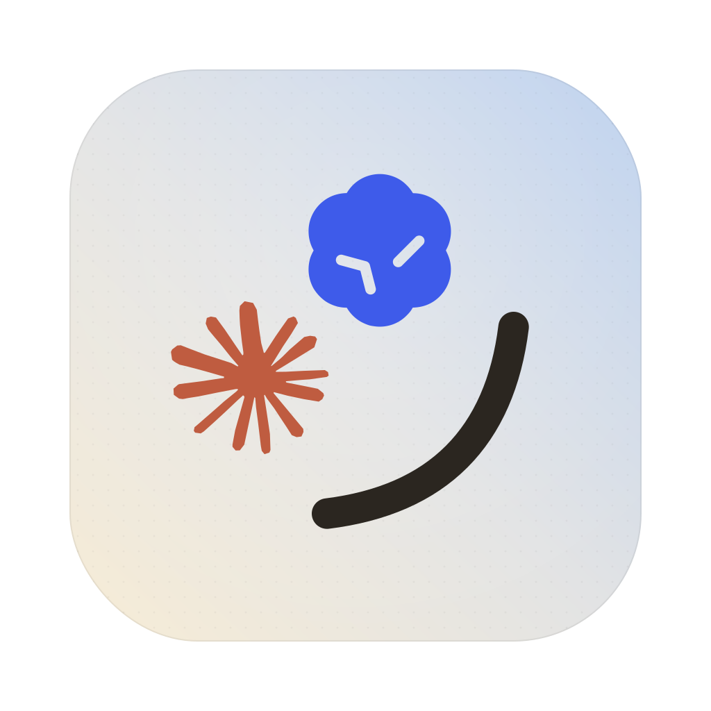
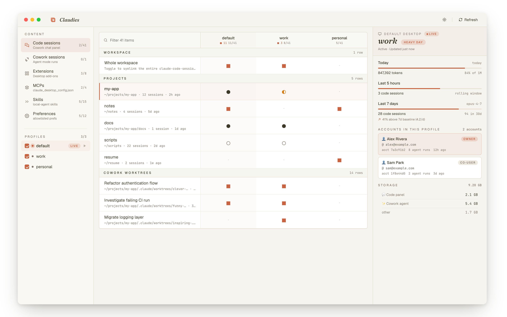

<p align="center">
  
</p>

<h1 align="center">Claudex</h1>

<p align="center">
  Run multiple <b>Claude</b> and <b>Codex</b> accounts side by side on macOS — fully isolated profiles, with cross-tool skill sharing.
</p>

<p align="center">
  <a href="https://opensource.org/licenses/MIT"></a>
  <a href="https://github.com/democra-ai/claudex/releases"></a>
  <a href="https://www.apple.com/macos/"></a>
  <a href="https://v2.tauri.app/"></a>
</p>

<p align="center">
  
</p>

Two walled-off profile worlds — **Claude** (Desktop + Code) and **Codex** — each with its own isolated logins, chats, settings, MCP, and skills. Open several windows at once, each on a different account. Skills are the one library both tools share: link a `SKILL.md` from Claude into Codex (or between profiles) right from the matrix. And import a session from one tool into the other as a fresh, resumable conversation.

> **Unofficial community tool.** Uses public Electron / Chromium flags (`--user-data-dir`) and the Claude Code env var (`CLAUDE_CONFIG_DIR`) to isolate profiles. Both Claude Desktop and the Codex desktop app are Chromium-based and honor `--user-data-dir`, so the same mechanism isolates each. Not endorsed by Anthropic or OpenAI.

## Features

- **Two worlds, one window** — a Claude region and a Codex region in the sidebar, each with its own `+` to add a profile and per-profile delete. Each profile is a Desktop launcher (`.app`) pointed at its own `--user-data-dir`, so logins never collide.
- **One click, two apps** *(Claude)* — adding a Claude profile creates the Desktop launcher (`Claude WORK.app`) *and* the Code CLI alias (`claude-work`) together.
- **Live status** — the sidebar polls every 10 s; the running profile gets a pulsing dot and a `LIVE` pill. Launch any profile with ▶.
- **Cross-tool skill sharing** — Skills (`SKILL.md` dirs) are the one surface Claude and Codex share. The Skills matrix shows your Claude Code profiles **and** a global Codex column; toggle a cell to symlink a skill across the boundary. Non-destructive — it never clobbers a skill it didn't create.
- **Content matrix** — every profile × every content item in one grid, with five-state glyphs (■ shared / ● copied / ◐ diverged / ○ independent / · absent). Per-kind captions say honestly what's cross-tool (Skills) vs Claude-only (extensions, MCP, sessions, preferences).
- **Cross-tool import** — bring a Codex session into Claude Code (or vice-versa) as a brand-new, resumable session. `convert codex claude` parses the Codex rollout and writes a fresh `~/.claude/projects/…` transcript you can `claude --resume`. Import, not sync — see [How it works](#how-it-works).
- **Profile detail** *(Claude)* — today's tokens, rolling 5h / 7d session counts, pace vs your own baseline, account identities, storage breakdown, sharing graph.
- **CLI included** — `add`, `list`, `status`, `convert`, `repair`, `remove`.

## Install

### App (recommended)

Grab the latest `.dmg` from **[Releases](https://github.com/democra-ai/claudex/releases/latest)** and drag **Claudex.app** to `/Applications`.

The build is unsigned, so first launch needs a right-click → **Open**, or:

```bash
xattr -dr com.apple.quarantine "/Applications/Claudex.app"
```

### CLI only

```bash
npm install -g github:democra-ai/claudex
```

Node 18+. The Code half works on Linux; the Desktop half is macOS-only because Claude Desktop is.

### Build from source

```bash
git clone https://github.com/democra-ai/claudex
cd claudex
npm install && npm run frontend:install
npm run tauri:dev      # GUI with hot reload
npm run tauri:build    # produces .app + .dmg
```

Requires Rust, Xcode CLT, Node 18+.

## Quick start

1. Open Claudex.
2. Sidebar bottom → **NEW PROFILE** → name it `work` → check ☑ Desktop + ☑ Code → click `+`.
3. `Claude WORK.app` lands in `~/Applications/`. Drag it to the Dock.
4. New terminal tab — the `claude-work` alias is live.
5. **Quit any other Claude window with Cmd+Q before first-launching the new profile** (the `claude://` auth deep link routes to whichever Claude is already running).

CLI equivalent: `claude-multiprofile add`.

## How it works

**Claude Desktop** is an Electron app and honors `--user-data-dir`, which relocates all app state (auth, chats, settings, MCP, projects) to a directory of your choosing. The launcher is a tiny AppleScript bundle: `open -n -a Claude --args --user-data-dir=/path/to/profile`. Different folder → different instance.

**Claude Code** honors the `CLAUDE_CONFIG_DIR` env var. The OAuth token in macOS Keychain is keyed by a SHA-256 of that path, so swapping the env var swaps the auth entirely.

**Sharing.** Two models. Extensions and skills are *symlinked* — edits propagate live both ways. MCP servers and preferences are *copy-on-apply* — you can't symlink a JSON key, so the value is written atomically (temp + rename) at Apply time.

<p align="center">
  
</p>

**Cross-tool import.** Claude Code and Codex store conversations in different on-disk formats (Claude: a `parentUuid` DAG of Anthropic-format messages under `projects/`; Codex: a linear log of OpenAI response-items under `sessions/`). They can't be losslessly synced — threading models differ and each tool's reasoning payloads are provider-private. So `convert` does the pragmatic thing: it reads the source session through a shared intermediate representation and **writes a new session in the target tool's format** (preserving text, tool calls, and tool results; dropping crypto reasoning and flattening branches). Codex→Claude is clean (Claude indexes from JSONL); Claude→Codex is best-effort (Codex also keeps a SQLite index its picker reads — for that direction, Codex 0.139.0+'s official `/import` is preferred).

## The matrix

Rows are content items, columns are the profiles you've checked. Each cell encodes share state as both a glyph and a color (legible at distance and for colorblind users):

| Glyph | State | Meaning |
|-------|-------|---------|
| ■ | Shared | Live symlink between ≥ 2 profiles — edits propagate |
| ● | Copied | One-shot copy, currently aligned |
| ◐ | Diverged | Same item, different values across profiles |
| ○ | Independent | Present here, not aligned with any other profile |
| · | Absent | Not in this profile |

## CLI reference

```bash
claude-multiprofile add            # interactive wizard (Desktop, Code, or both)
claude-multiprofile list           # configured profiles + paths
claude-multiprofile status         # health-check directories, .apps, aliases
claude-multiprofile extensions <p> # multi-select copy Desktop extensions
claude-multiprofile convert <f> <t> [s]  # import a session between claude<->codex
claude-multiprofile repair <p>     # re-register macOS launcher (icon-cache fix)
claude-multiprofile remove <p>     # tear down a profile (data kept by default)
claude-multiprofile upgrade        # pull latest from GitHub
```

Pass `--help` to any command for flags.

## Tech stack

| Layer | Tool |
|-------|------|
| Desktop runtime | [Tauri 2](https://v2.tauri.app/) (Rust) |
| macOS chrome | [tauri-plugin-decorum](https://github.com/clearlysid/tauri-plugin-decorum) for single-row title bar + inset traffic lights |
| Frontend | React 18 + Vite + TypeScript |
| Styling | Tailwind CSS + [shadcn/ui](https://ui.shadcn.com/) |
| CLI | Node 18+ + [@inquirer/prompts](https://www.npmjs.com/package/@inquirer/prompts) |

## Comparison

| Tool | Desktop | Code | GUI | macOS | Linux |
|------|:-------:|:----:|:---:|:-----:|:-----:|
| **Claudex** | ✓ | ✓ | ✓ | ✓ | partial |
| [aimux](https://github.com/Digital-Threads/aimux) | — | ✓ | — | ✓ | ✓ |
| [aisw](https://crates.io/crates/aisw) | — | ✓ | — | ✓ | ✓ |
| [Jean-Claude](https://madewithlove.com/blog/running-multiple-claude-accounts-without-logging-out/) | — | ✓ | — | ✓ | ✓ |

## Security

Reads & writes only inside the per-profile data folders, the launcher `.app` bundles in `~/Applications/`, the registry at `~/.config/claude-multiprofile/`, and a delimited managed block in `~/.zshrc`. Never touches your default Claude install, macOS Keychain, IndexedDB / cookies, or anything else on disk. CLI has one runtime dep (`@inquirer/prompts`); the Tauri app's release bundle vendors its own runtime.

## Acknowledgments

- **[claude-multiprofile](https://github.com/jmdarre-v/claude-multiprofile)** (upstream, by jmdarre-v) — the CLI wizard, registry, macOS launcher generation, and shell-alias handling are derived from this MIT-licensed project. Preserved here under the same terms.
- **[tauri-plugin-decorum](https://github.com/clearlysid/tauri-plugin-decorum)** (by clearlysid) — the NSWindow Objective-C bindings that give us a proper single-row title bar with inset traffic lights.
- **Anthropic** — for Claude Desktop and Claude Code. Native multi-account is in their open feature requests ([Desktop](https://github.com/anthropics/claude-code/issues/32783), [Code](https://github.com/anthropics/claude-code/issues/18435)); this tool fills the gap until then.

## License

MIT — see [LICENSE](./LICENSE). Original copyright lines from the upstream fork are preserved.
